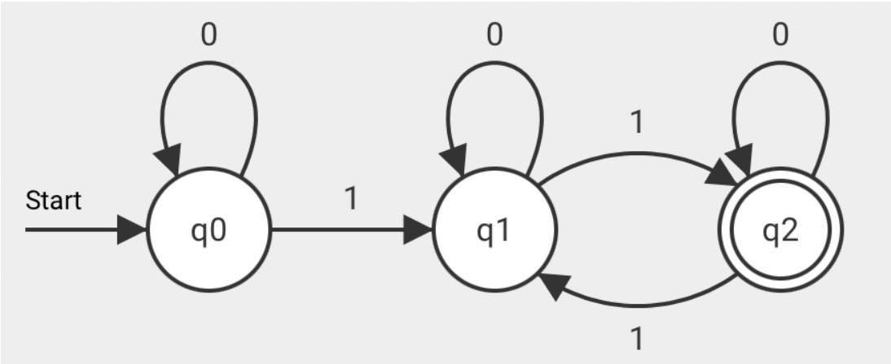
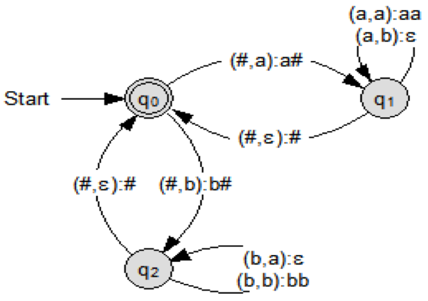

# Automaten und formale Sprachen

Hier finden sich Informationen zu Automaten und formalen Sprachen

# Automaten

## Definition Automaten:

Ein Automat ist ein Erkennungssystem für eine gegebene Sprache `L` über dem Alphabet `Σ`.
Die Menge aller Zeichenreihen, die ein Automat akzeptiert ist auch die Sprache, die ein Automat akzeptiert.
Automaten sind entweder deterministisch (DEA) oder nichtdeterministisch (NEA) Der gesamte Automat ist dabei endlich. Er besteht aus Zuständen, Zustandsübergängen, einen Startzustand (oder mehrere beim NEA), Eingaben und Endzustände.
Jeder Automat hat eine Zustandsübergangsfunktion (Tabelle/Automat)

Tabelle: Zeilen sind Zustände; Spalten die möglichen Eingaben; Felder

der Zustand, zu dem der Automat bei entsprechender Eingabe wechselt

## NEA vs DEA

## Ablaufdiagramm NEA und DEA

## Akzeptor:

`A` = (Ʃ, Q, F, S, σ) 
`Ʃ` = {Eingabealphabet} 
`Q` = {Zustandsmenge (endlich, nicht leer)} 
`F` = {Akzeptierte Zustände (Menge >= 1)} 
`S` = Startzustand  
`σ` = Zustandsübergänge (graphischer Automat/Tabelle)

## Transduktor (Mealy):

`A` = (Ʃ, Q, Ω, S, σ) 
`Ω` = {Ausgabealphabet}

## Kellerautomat:

`K` = (Ʃ, Q, F, S, Γ, K, σ) 
`Γ` = {Kelleralphabet} 
`K` = Kellervorbelegungszeichen 

`ɛ` als Eingabe: keine Eingabe 
`ɛ` als Kelleroperation: nichts schreiben (= löschen) 
`#` = Kellerboden Jeder Blick in den Keller löscht das oberste Zeichen

Kelleroperationen wie beim Stack: Push, Pop und Nop

## NEA zu DEA:

Tablelle erstellen, Spaleten mit allen möglichen Eingaben beschriften

In die erste Zeile kommen alle Startzustände des NEAs (z.B. s0, s1)  
Die Felder werden dann mit allen Zuständen befüllt, in die der NEA mit entsprechender Eingabe wechseln würde.  
In die nächsten Spalten kommen dann alle möglichen Zustandskombinationen, die in den ersten Feldern eingetragen wurden. 
Schritt 3 + 4 werden wiederholt, bis alle Kombinationen untersucht wurden 

Die Tabelle beschreibt dann den passenden DEA und könnte als Automat visualisiert werden.

# (Formale) Sprachen

## Definition Alphabet

Ein Alphabet `Ʃ` ist eine endliche, nicht leere Menge and Zeichen (z.B. Buchstaben und Zahlen)

## Definition Wort

Eine Aneinanderreihung von n > 0 Zeichen eines Alphabets
Die Anzahl an Zeichen bzw. die Länge des Wortes wird dabei durch Betragsstriche gekennzeichnet
(Ausnahme `|ɛ| = 0` )

## Definition Sprachen

Eine Sprache `L` ist eine Menge von Wörtern bestehend aus Zeichen eines Alphabets `Ʃ`. Formale Sprachen können nach Regeln aufgebaut sein, müssen aber nicht. Sie können durch Automaten, Grammatiken oder reguläre Ausdrücken beschrieben werden. Der Betrag der Sprache ist die Anzahl aller Wörter innerhalb der Sprache. Sprachen können aus unendlich vielen Wörtern bestehen. Eine Sprache kann (links-, rechts-) regulär, kontextfrei, kontextsensitiv und rekursiv aufzählbar sein

### Regulärer Ausdruck:

L = { a^nb^n | n E IN, n > 0 }

## Grammatiken

Grammatik: G = (N, T, S, P)  
N = {Nichtterminale (in Großbuchstaben)} 
T = {Terminale}  
S = Startnichtterminal 
P ={ 
Projektion,  
z.B.A -> aA | ɛ  
}  
L(A) -> Sprache eines Automaten

## Chomsky Hierarchie

Eine von dem Linguisten Noam Chomsky entwickelte Hierarchie zur Differenzierung und klaren Einteilung von Sprachen und deren Grammatiken.

### Kontextfreie Sprachen

(Die Sprache, die von einem Kellerautotmaten Akzeptiert wird gehöhrt genau zu den kontextfreien Sprachen)

TODO

### Kontextsensitive Sprachen:

TODO

### Links- bzw. rechtsreguläre Grammatiken

TODO