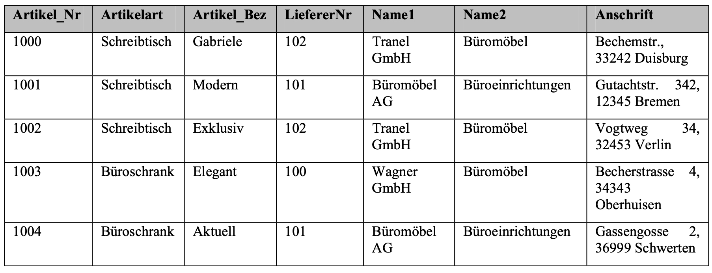
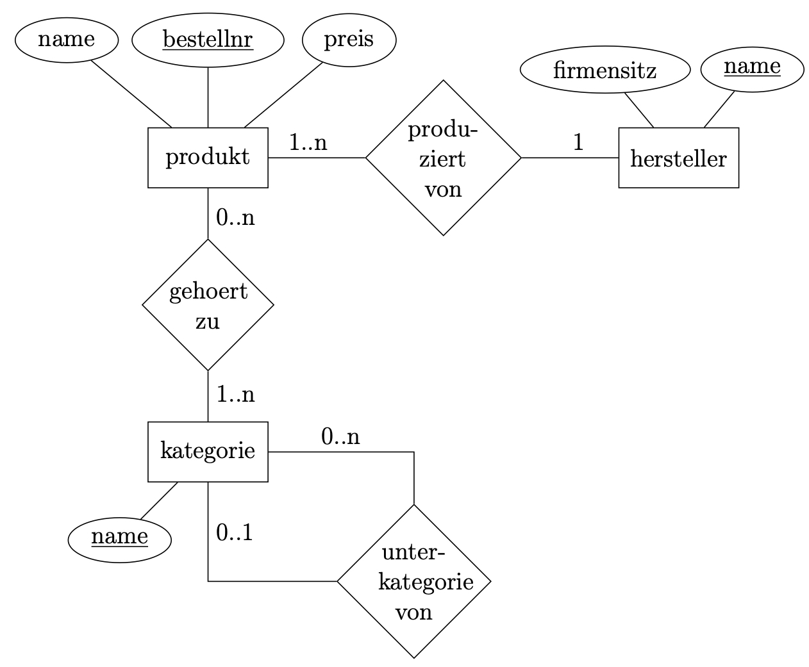

# Datenbanken

Datenbanken dienen der **elektronischen Datenverwaltung**. In einer Datenbank werden Datensätze zusammengefasst. Dazu werden Datenbankmanagementsysteme (DBMS) wie SQL benutzt.



### Begriffe

- **Entität** - Zeile im Datensatz
  - **Attribut** - Beschreibt eine Eigenschaft
    - **Felddatentyp** - Text, Zahl, Wahrheitswert, Autowert etc.
- **Spalte** - Datenfeld
- **Tabelle** - Relation (Zusammenfassung gleichartiger Entitäten)
- **Redundanzen** - Doppelungen
- **Datenanomalien** - Datenunregelmäßigkeiten
- **Schlüssel**
  - **Primärschlüssel** - Dient der eindeutigen Identifizierung einer Entität
  - **Sekundärschlüssel** - Auch Fremdschlüssel genannt; Attribut in einer Tabelle, das in einer Entität, zu der eine Beziehung besteht, als Primärschlüssel definiert wurde.
- **Kardinalität** - Anzahl der an einer Beziehung beteilitgen Entitäten (Beziehungsmenge)
- [**Normalisierung**](#normalformen)

## ER-Diagramm



Das Entity-Relationship-Diagramm dient dem Modellieren von Datenbanken. Es besteht aus drei Elementen: Entitäten, Beziehungen und Attributen. Entitäten sind Objekte, die in der Datenbank gespeichert werden. Beziehungen sind die Verbindungen zwischen den Entitäten. Attribute sind Eigenschaften der Entitäten.
Zum Beispiel kann eine Entität `Person` sein und eine Beziehung zwischen der Entität `Person` und der Entität `Adresse` bestehen. Die Entität `Adresse` hat die Attribute `Straße`, `Hausnummer`, `PLZ` und `Stadt`. Die Entität `Person` hat die Attribute `Vorname`, `Nachname` und `Alter`. Die Beziehung zwischen Person und Adresse ist eine 1:n-Beziehung, da eine Person nur eine Adresse hat, aber eine Adresse mehrere Personen haben kann.

## Transitive Abhängigkeit

## Normalformen

Das Ziel der Normalformen ist das überführen der Daten in eine Form, die eine

- möglichst geringe Redundanz
- keine Anomalien

aufweist. Vorteile sind dabei:

- Reduzierter Arbeitsaufwans
- Fehlervermeidung
- Eingabeerleichterung
- Speicherplatzeinsparung (keine Redundanzen)
- übersichtlicher

> Graphische Erklärung der Normalformen: https://www.tinohempel.de/info/info/datenbank/normalisierung.htm

Die Normalformen sind in der Reihenfolge der Anwendung auf die Datenbank zu verstehen. Die Normalformen sind:

### 1. Normalform (atomar)

Vorraussetzung für die erste Normalform ist, dass jeder Wert in atomarer Form vorliegt. Das bedeutet, dass zum Überführen einer Datenbank in die erste Normalform eine Adresse von der Form `Straße 1 12345 Stadt` in die Form `Straße, Hausnummer, PLZ, Stadt` überführt werden muss. Ggf entstehen neue Primärschlüssel, da bestehende ihre Eindeutigkeit verlieren können

### 2. Normalform (funktionale Abhängigkeit)

Ein Relationsschema befindet sich in der 2. Normalform, wenn

- es in der 1. Normalform ist und
- jedes Nicht-Schlüssel-Attribut vom Primärschlüssel voll funktional abhängig ist.

Um die 2. Normalform zu erreichen, muss die Tabelle oft aufgeteilt werden, da mehrere Primärschlüssel für Attribute existieren können. Funktionale Abhängigkeit bedeutet, dass zu einem bestimmten Wert eines Attributs, lediglich ein Wert möglich ist. (Quasi pro Tabelle nur ein Primärschlüssel, der genau son Attribut identifiziert du Pflaume)

### 3. Normalform (transitive Abhängigkeit)

Ein Relationenschema befindet sich in der 3. Normalform, wenn

- es in der 2. Normalform ist und
- jedes Nichtschlüsselattribut nicht transitiv vom Primärschlüssel abhängig ist, d.h. **aus keinem Nichtschlüsselattribut folgt ein anderes Nichtschlüsselattribut.**

Folgt innerhalb einer Tabelle aus einem Nichtschlüsselattribut ein anderes? Bspw. folgt aus einer PLZ auch der Ort, sowas muss also in ne neue Tabelle.

## Relationsschema

###

## Implementation

### Java

```java
private DatabaseConnector connector;
connector = new DatabaseConnector("Irgendein Quatsch", 8888, "path/to/database.db", "username", "password");
connector.executeStatement("SELECT column FROM myTable");
QueryResult queryResult = connector.getCurrentQueryResult();
String[][] table = queryResult.getData(); //Tabelleninhalt [Zeile][Spalte]
String[] columnNames = queryResult.getColumnName(); //Spaltennamen
```

### DatabaseConnector
| Methode | Beschreibung | Rückgabewert |
| ------- | ------------ | ------------ |
| `DatabaseConnector(String host, int port, String database, String username, String password)` | Erstellt eine neue Datenbankverbindung | DatabaseConnector |
| `executeStatement(String statement)` | Führt einen SQL-Befehl aus | void |
| `getCurrentQueryResult()` | Gibt das Ergebnis der letzten Abfrage zurück      | QueryResult |
| `close()` | Schließt die Datenbankverbindung | void |
| `getErrorMessage()` | Gibt die Fehlermeldung der letzten Abfrage zurück | String |
### QueryResult

| Methode            | Rückgabe                       | Rückgabewert |
| ------------------ | ------------------------------ | ------------ |
| `getData()`        | Daten der Abfrage              | String[][]   |
| `getColumnNames()` | Spaltennamen der Abfrage       | String[]     |
| `getColumnTypes()` | Datentypen der Spalten         | String[]     |
| `getRowCount()`    | Anzahl der Zeilen der Abfrage  | int          |
| `getColumnCount()` | Anzahl der Spalten der Abfrage | int          |

### SQL

```sql 
SELECT * FROM myTable;
```

https://play.typeracer.com?universe=lang_de&rt=22wtaf1vb1
