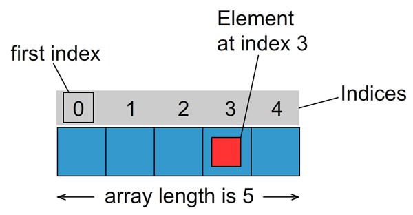
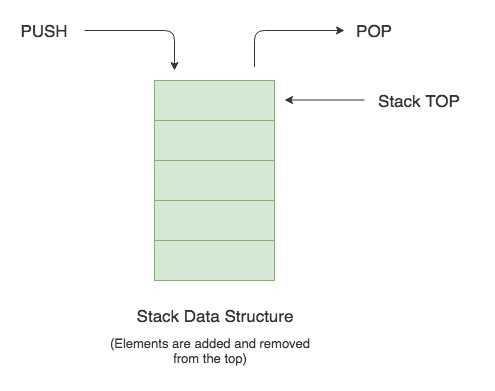
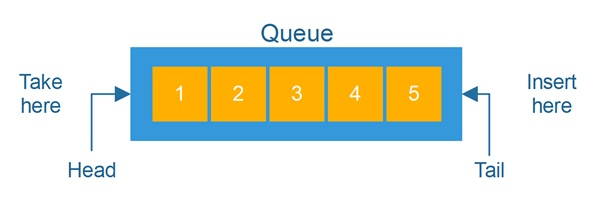
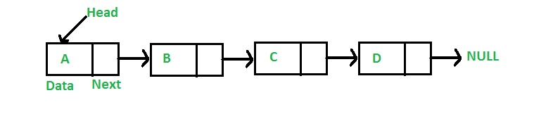

# Lineare Datenstrukturen

Modellierung, Implementierung und Anwendung dynamischer und statischer, linearer Datenstrukturen

## Übersicht der linearen Datentypen
| Queue | Stack | List |Array |
|--|--|--|--
| FiFo (first in first out) | FiLo (first in last out) | Jeder kennt den Nachfolger | Durch Index an den Wert
| Beispiel: Schlange im Supermarkt | Beispiel: Stapel an Kartons | Beispiel: Diese komische Wartesituation beim Friseur | Beispiele: Sitzplätze und Namen 

### Array

|Anwendung |Implementation
|-|-|
|Initialisierung eines neuen Arrays der Klasse `ContentType` mit der länge `x`| `newArray ContentType [] = new ContentType [x]` |
|Erfragen des Wertes in Feld `x` des Arrays| `newArray[x]` |
|Setzten des Wertes in Feld `x` des Arrays| `newArray[x]= ContentType()` |
|Initialisieren eines 2 Dimensionalen Arrays mit `x` Zeilen und `y` Spalten | `newArray ContentType[][] = new ContentType [x][y]`|

### Stack

Ziel | Umsetzung 
|--|--|
|Initialisieren eines neuen Stacks|`Stack neuerStack <ContentType> =new Stack <ContentType>();`
|Abfrage, ob der gegebene Stapel befüllt ist. Ist der gegebene Stack leer, wird der Wahrheitswert `true` zurück gegeben |`neuerStack.isEmpty(); => boolean`
|Setzt ein neues Object der Klasse `ContentType` auf den bereits bestehenden Stack drauf |`neuerStack.push();`
|Löscht das oberste Element des Stapels|`neuerStack.pop();`
|Gibt das oberste Objekt des Stackt zurück|`neuerStack.top()=> ContentType;`

### Queue

Ziel | Umsetzung 
|--|--|
|Initialisieren einer neuen Queue|`Queue neueQueue <ContentType> = new Queue <ContentType>();`
|Abfrage ob die Queue leer ist. Wenn die Queue leer ist, dann wird der Wahrheitswert `true` zurück gegeben. |`neueQueue.isEmpty() => boolean;`
|Eine neues Objekt, stellt sich hinten in der Schlange an|`neueQueue.enqueue();`
|Das forderste Objekt wird aus der List gelöscht und das zweite Objekt wird zum Head|`neueQueue.dequeue();`
|Gibt einen das erste Objekt in der Liste zurück|`neueQueue.front();`

### List

Ziel | Umsetzung 
|--|--|
|Initialisieren einer neuen Liste|`List neueListe <ContentType> = new Liste <ContentType>();`
|Abfragen, ob die Liste leer ist. Wenn sie leer ist, wird der Wahrheitswert `true` zurückgegeben.|`neueListe.isEmpty();`
|Prüfen, ob Zugriff auf die Liste besteht. Wenn die Liste leer ist oder das aktuelle Element am Ende der letzen Liste steht, wird `true` zurückgegeben |`neueListe.hasAccess(); => boolean`
|setzt das nächste Element der Liste als aktuelles Element|`neueListe.next();`
|setzt das erste Element der Liste als aktuelles Element|`neueListe.toFirst();`
|setzt das letze Element der Liste als aktuelles Element|`neueListe.toLast();`
|gibt den Wert des aktuellen Objektes wieder |`neueListe.getContent(); => ContentType`
|setzt den Wert des aktuellen Objektest|`neueListe.setContent();`
|fügt ein neues Objekt der Klasse `ContentType` nach der aktuellen Position in die Liste ein |`neueListe.insert();`
|fügt ein neues Objekt der Klasse `ContentType`am Ende der Liste ein|`neueListe.append();`
|hängt eine Liste an das Ende der Liste an|`neueListe.concat();`
