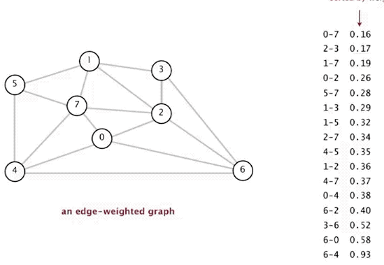
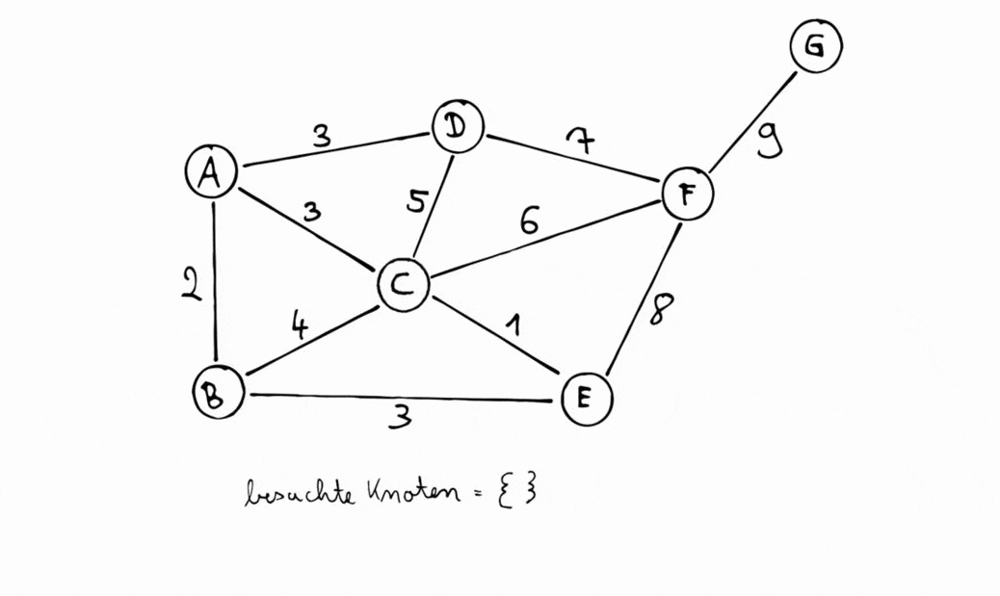

# Graphen

zusammenhängend, gerichtet, ungerichtet, gewichtet, ungewichtet

## Graph

Ein Graph ist eine nicht lineare Datenstruktur,  nicht-hierarchische Datenstruktur. 
Ein Graph besteht grundlegend aus Knoten und Kanten. Besitzten alle Kanten des Graphen mindestens einen Wert oder auch fachsprachlich eine Gewichtung,so handelt es sich um einen gewichteten Graphen. Graphen werden meist genutzt um in der Realität bestehende Infrastrukturen, wie Verkehrs-, Strom-, oder Internnetzte darzustellen und zu analyisieren (hinsichtlich redundanz, effizienz, ...). Eine Kante kann zwei Knoten auch nur in eine Richtung verbinden, in diesem Fall handelt es sich um eine gerichtete Kante. Besteht ein Graph ausschliesslich aus gerichteten Kanten, so handelt es sich bei dem Graphen um einene gerichteten Graphen. 

### Weg 
Einen Weg in einem Graphen gibt man als Folge der dabei durchlaufenen Knoten an.Endet ein Weg an demselben Knoten, an dem er begonnen hat, so spricht man von einem Rundweg (Zyklus). Besitzt ein Graph mindestens einen Zyklus, so spricht man von einem zyklischen Graphen.

### Zusammenhängende Graphen 

Kann man von jedem Knoten aus jeden anderen Knoten über einen Weg erreichen,
so nennt man diesen Graph einen zusammenhängenden Graphen.

### Vollständigkeit 

Ein vollständiger Graph hat von jedem Knoten zu jedem anderen Knoten eine direkte Kante. Ist ein Graph fast vollständig, so bezeichnet man ihn als dichten Graph. Ist ein Graph weit davon entfernt, vollständig zu sein, so bezeichnet man ihn als dünnen Graph.


|Erklärung|Implementation|
|-|-|
Der Auftrag fügt den Knoten pVertex vom Typ Vertex in den Graphen ein, sofern es noch keinen Knoten mit demselben ID-Eintrag wie pVertex im Graphen gibt und pVertex eine ID ungleich null hat. Ansonsten passiert nichts | `addVertex(Vertex pVertex)`
|Der Auftrag fügt die Kante pEdge in den Graphen ein, sofern beide durch die Kante verbundenen Knoten im Graphen enthalten sind, nicht identisch sind und noch keine Kante zwischen den beiden Knoten existiert. Ansonsten passiert nichts.|`addEdge(Edge pEdge)`
Der Auftrag entfernt den Knoten pVertex aus dem Graphen und löscht alle Kanten, die mit ihm inzident sind. Ist der Knoten pVertex nicht im Graphen enthalten, passiert nichts. | `removeVertex(Vertex pVertex)`
||`removeEdge(Edge pEdge)`
||`getVertex(String pID) => Vertex`
||`getVertices() => List <Vertex>`
||`getNeighbours(Vertex pVertex) = List <Vertex>`
||
||
||
||

## Edge
Eine Edge ist eine Verbindung zwischen zwei Knoten. Sie kann auch als Kante oder Verbindung bezeichnet werden.
In der Abiturimplemtation ist diese Verbindung ungerichtet, d.h. die Kante kann in beide Richtungen verlaufen.
Außerdem kann eine Kante markiert werden und hat eine Gewichtung.

### Implementation

```java
Edge edge = new Edge(vertex1, vertex2, 42 /* Gewichtung */);
edge.setMarked(false);
edge.isMarked();
edge.setWeight(42);
edge.getWeight();
edge.getVertices();
```

## Vertex
Ein Vertex ist ein Knoten eines Graphen. Er kann auch als Knotenpunkt oder Knoten bezeichnet werden.
Jeder Vertex hat eine eindeutige ID, die als Schlüssel für den Vertex dient.
Außerdem kann ein Vertex markiert werden.

### Implementation

```java
Vertex vertex = new Vertex("Id meiner Träume");
vertex.setMarked(false);
vertex.isMarked();
vertex.getId();
```

# Gerichtet vs ungerichtet

Adjazenzmatrix, Adjazenzliste
Tiefensuche, Breitensuche

# Backtracking

Eleminieren aller Möglichkeiten, die nicht zu dem gewünschten Ziel führen können, um so die Laufzeit zu verringern (Dijkstra: das ausschliessen von Wegen, zu einem Übergangsknoten, zu dem bereits ein kürzerer Weg führt)

# Dijkstra

Algorithmus zum ermitteln des kürzesten Weges von einem gegebenen Startknoten zu einem Endknoten. ACHTUNG auch wieder ein greedy-algorithmus, der nicht die global beste Lösung liefert.

# Hammiltonkreis

Ein geschlossener Weg, der jeden Knoten genau einmal enthält. Er benötigt mindestens 3 Knoten, da sonst ein Kreis nicht möglich ist.

## Java-Implementation

```java
public boolean isHamiltonnianCircle(Graph graph) {
    List<Vertex> vertices = graph.getVertices();
    vertices.toFirst();
    while (vertices.hasAccess()) {
        Vertex vertex = vertices.getContent();
        List<Vertex> neighbours = graph.getNeighbours(vertex);
        int count = 0;
        neighbours.toFirst();
        while (neighbours.hasAccess()) {
            count++;
            neighbours.next();
        }
        if (count != 2) {
            // No Hamiltonnian Circle
            return false;
        }
    }
    // Hamiltonnian Circle
    return true;
}
```

# Hammiltonweg

Ein Weg, der jeden Knoten genau einmal enthält. Er benötigt mindestens 2 Knoten, da sonst ein Weg nicht möglich ist.

## Java-Implementation

```java
public boolean isHamiltonnianPath(Graph graph) {
    List<Vertex> vertices = graph.getVertices();
    vertices.toFirst();
    while (vertices.hasAccess()) {
        Vertex vertex = vertices.getContent();
        List<Vertex> neighbours = graph.getNeighbours(vertex);
        int count = 0;
        neighbours.toFirst();
        while (neighbours.hasAccess()) {
            count++;
            neighbours.next();
        }
        if (count != 1 && count != 2) {
            // No Hamiltonnian Path
            return false;
        }
    }
    // Hamiltonnian Path
    return true;
}
```


# Eulerkreis

Ein Weg, der jede Kante genau einmal enthält und desses Starknoten auch der Endknoten ist.

Vorraussetzung:
Kein Knoten besitzt einen ungeraden Grad.

## Java-Implementation

```java
public boolean isEulerianCircle(Graph graph) {
    List<Vertex> vertices = graph.getVertices();
    vertices.toFirst();
    while (vertices.hasAccess()) {
        Vertex vertex = vertices.getContent();
        List<Vertex> neighbours = graph.getNeighbours(vertex);
        int count = 0;
        neighbours.toFirst();
        while (neighbours.hasAccess()) {
            count++;
            neighbours.next();
        }
        if (count % 2 != 0) {
            // No Eulerian Circle
            return false;
        }
    }
    // Eulerian Circle
    return true;
}
```

# Eulerweg

Ein Weg, der jede Kante genau einmal enthält.

Vorraussetzung:
Genau 2 Knoten besitzten einen ungeraden Grad.

## Java-Implementation

```java
public boolean isEulerianPath(Graph graph) {
    List<Vertex> vertices = graph.getVertices();
    vertices.toFirst();
    int count = 0;
    while (vertices.hasAccess()) {
        Vertex vertex = vertices.getContent();
        List<Vertex> neighbours = graph.getNeighbours(vertex);
        int countNeighbours = 0;
        neighbours.toFirst();
        while (neighbours.hasAccess()) {
            countNeighbours++;
            neighbours.next();
        }
        if (countNeighbours % 2 != 0) {
            count++;
        }
        vertices.next();
    }
    if (count == 2) {
        // Eulerian Path
        return true;
    }
    // No Eulerian Path
    return false;
}
```

## Minimaler Spannbaum **(sollen hier noch Laufzeiten rein?)**

Teilgraph eines Graphen, der mindestens nötig ist, um alle Knoten möglichst kostengünstig zu verbinden. Zur Berechnung eines minimalen Spannbaums eines zusammenhängenden, gewichteten Graphen gibt es zwei Algorithmen: Kruskal und Prim.<br>
**WICHTIG**: Die Algorithmen bestimmen nur die aktuell beste Möglichkeit, nicht aber die global beste Lösung ([Greedy-Algorithmen](#probleme-mit-greedy-algorithmen)).

### Kruskal

1. Kanten aufsteigend (nach Gewicht) sortieren
2. Kanten einem neuen Graphen schrittweise (beginnend mit der geringsten Gewichtung) hinzufügen
3. Entsteht durch das Einfügen ein Kreis, wird die Kante nicht hinzugefügt.
> Der Algorithmus kann theoretisch abbrechen, sobald alle Knoten mit mindestens einer Kante verbunden sind. Läuft er weiter, wird er aber keine Kanten mehr hinzufügen, da dadurch ein Kreis entstehen würde.



(MST: Minimal Spanning Tree | [Quelle](https://www.thealgorist.com/Algo/GraphTheory/Kruskal))

### Prim

1. Einen beliebigen Knoten auswählen
2. Alle Kanten des Knotens einer Liste hinzufügen
3. Der nächste, ausgewählte Knoten ist derjenige, der mit minimalsten Kosten zu erreichen ist
4. Auch die Kanten des neuen Knoten werden der Liste hinzugefügt und es wird wieder ein noch nicht verbundener Knoten mit minimalsten Kosten ausgewählt
5. Dies wird wiederholt, bis alle Knoten des Graphen Teil des neuen Graphen sind.



([Quelle](https://www.youtube.com/watch?v=T4crSlGNtLM))

## Probleme mit Greedy-Algorithmen

Dijkstra, Kruskal und Prim sind Algorithmen, die nicht in der Lage sind, die global beste Lösung zu finden (heuristische Lösung). Sie finden immer nur die aktuell beste Lösung. Ein Beispiel dafür ist das [Travelling Salesman Problem](https://de.wikipedia.org/wiki/Problem_des_Handlungsreisenden).
